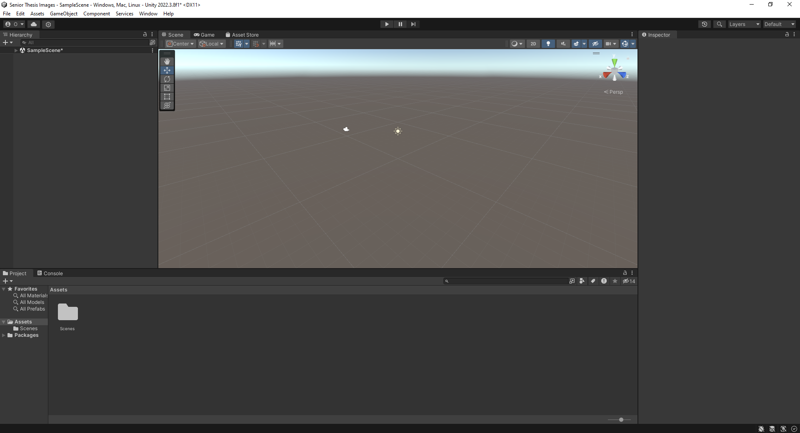
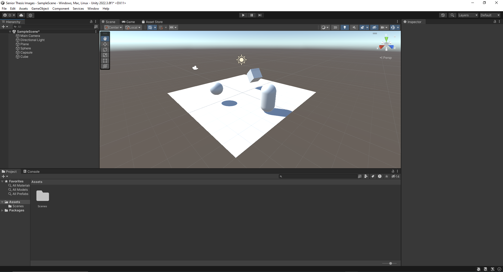
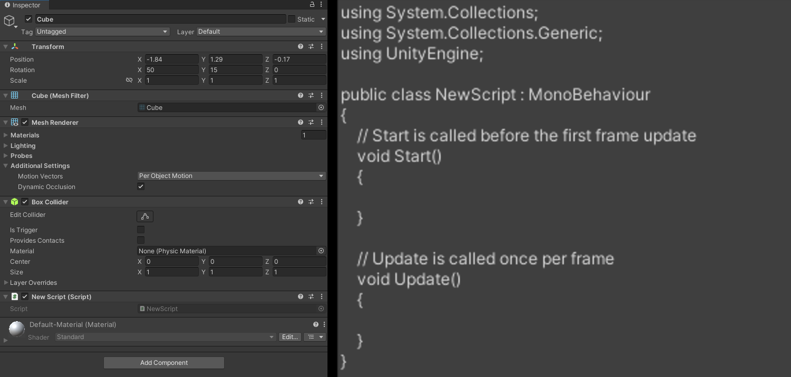
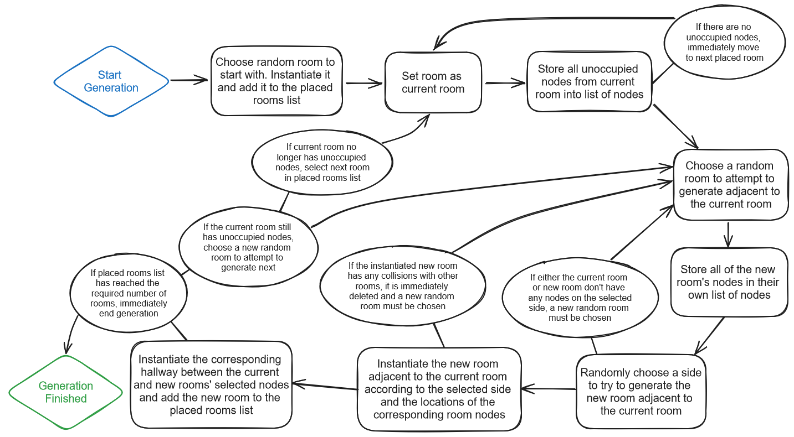
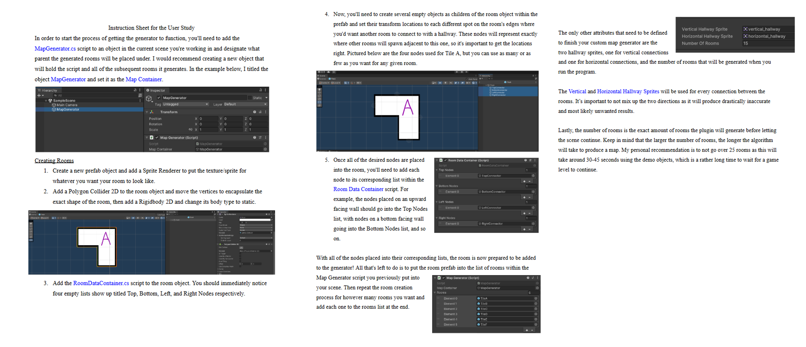
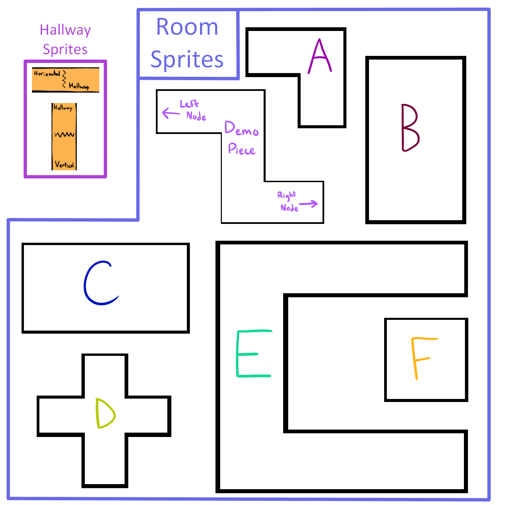

# Introduction

## Opening

  Game development in the modern day has become more accessible than ever before
with access to game engines like Unity that provide an interface the user can
easily interact with to create polished games [@haas2014history]. Even within the
engines themselves, there are additional tools that can be installed to make the
process of game development even easier through the use of plugins. These plugins can
be imported into most projects and are essentially just pre-made pieces of code that
do something specifically useful to the given project it's installed for. There are
an abundance of plugins with specific functions that could be useful for a wide array
of games, and it's great to see that many game developers create these plugins so that
others can have an easier time entering the game development space. It's no wonder that
there are so many high quality games being released from independent, amateur game
developers when the tools to do so are just a few internet searches away. This project
is an attempt to make game development even more accessible by creating a Unity plugin
to assist with the random generation of maps, specifically in the style of Roguelike
games.

  When it comes to recent trends in the indie game development space, Roguelikes have
been rather popular for several reasons. The first has to do with the core aspects of
the Roguelike genre, one of which is that whenever you lose in the game, you must start
back from the beginning. In most modern Roguelikes, there's some form of progression
over time where you can unlock things to use at the start of a given run through the
game by completing objectives over the course of several runs. This is mostly so that
the gameplay experience doesn't become too frustrating and to save some progress instead
of starting from scratch. The other main element of Roguelikes, and the one this project
is focused on, is that they heavily involve random generation to vary the gameplay
experience. Usually things like enemies, items, and level layouts are randomly generated
so that the player must adapt to the new challenge to succeed.

  The part of Roguelike generation that is key to this project is the randomization of
level layouts, also known as maps. Having random level layouts is one of the simplest
ways of keeping the gameplay super engaging and varying in a Roguelike. For most
Roguelikes, if the environment you had to traverse was the same every time you started a
run, it would feel extremely repetitive after only a short time of playing. While it's
standard for games in this genre to have randomly generated maps, most games play very
differently and necessitate different kinds of maps. Although it is such an important aspect,
it can be very difficult to understand and implement map generation algorithms if you're
unfamiliar with how they operate.

  This is why the software created for this project is a Unity plugin to assist in the
process of random map generation. It takes pre-made rooms created by the user
and places them around an area before connecting each one with hallways to generate
sprawling, dungeon-like maps. The goal isn't just to create a good generation
algorithm, but primarily to make the plugin easy to use so that those unfamiliar
with coding something like it would still have the ability to create the game they
want. In addition, the plugin itself is robust with many options for the user to select
from to specify parts of the generation process. Overall, it's a practical, low effort
way for amateur game developers to more easily create games in the Roguelike genre.

## Current State of the Art

  There are two main ways to generate a map for a game: tile-by-tile generation and
room-and-connector based generation. The tile-by-tile generation essentially creates a
map from scratch by filling every tile in a given area with various objects or enemies
based on the criteria provided to the algorithm. These games must have a specific algorithm
for determining what can and cannot be placed in each tile based on surrounding tiles,
existing tiles, and many other factors. A good example of this generation style is in the
game Spelunky, where you're playing as an explorer trying to find treasures throughout a
series of locations under the earth, with each increasing in difficulty as you explore. The
levels are procedurely generated to have specific enemies and special tiles according to
the aesthetic and design requirements for the current area [@baghdadi2015procedural]. This
generation technique makes sense for the type of environment they're going for, and it
especially makes it feel as though you're exploring a sprawling, expansive mine filled with
dangers that could be around any corner.

![A screenshot from the game Spelunky [@martin2021spelunky]](images/Spelunky-Credit-Blitworks-2%402000x1133.jpg)

  The room-and-connector generation varies a bit from tile-by-tile in that it doesn't go
through every position on the map and determine what can and cannot be there, but instead
takes a set of pre-made rooms that were created before starting and places them randomly
around the permitted generation space before connecting the various rooms to form a
dungeon-like map. This doesn't require anywhere near as complex of an algorithm as the
tile-by-tile generation, but it does need to keep track of the locations of rooms, what's
in them, and check for any overlaps between the rooms and the connectors between them. An
example of this generation style can be seen in the game Enter the Gungeon
[@dodgeroll2016gungeon]. The goal of the game is to get through the five main levels by
exploring the rooms of each map to find loot before challenging the boss and moving to the
next level. Each level in Enter the Gungeon is generated by choosing from a set of rooms
that change each floor and randomly placing them before connecting each one with hallways
on their designated hallway location points. This second type of generation is the one that
this project implements.

![An example of a map generated in the game Enter the Gungeon [@boris2019gungeon]](images/gungeon_castle.png)

## Motivation

  A lot of the motivation for this project stems from two things: the increase in
access to game development software and the lack of this desired tool in the
game development space. With engines being so commonly used to develop games
and countless plugins being readily available for anybody to use, it makes sense
for this tool to exist within the space. Creating more ways for people to get
into game development easier is most often a good thing as it allows more
people to build their ideas. The second main motivating factor is that there currently
just isn't any tool that helps with this type of generation. There are many resources
that discuss map generation and how to create the algorithms that go into them, and
although there are plugins available to assist with tile-by-tile generation, there's no
precedent for helping developers with the room-and-connector generation this software
implements. There are even examples of people online asking about how to perform map
generation similar to that of Enter the Gungeon, so it is very clearly a tool that
people want and would use to help develop games [@night2018generation].

## Goals of the Project

  While the goal of making the plugin was to create an interactive system for generating
maps for Roguelike games, the primary objective while doing it was to make it accessible
for those wildly unfamiliar with how map generation works. This is why the user study
discussed later was conduced the way that it was, because feedback on user interactivity
and ease of use was the most important factor in determining the success of the plugin.
Additionally, the plugin was meant to be versatile, with the ability to generate drastically
different maps depending on the settings toggled by the user. This allows for users to
tailor the plugin to do exactly what they need for any kind of game they're making with this
generation style. It was important that both of these things were implemented in the final
plugin so that it would be well-rounded and easy to use for anyone, making game development
an even more approachable activity for newcomers.

## Ethical Implications

  Although a tool that assists game developers with a fairly specific task doesn't seem as
though it would be able to bring any harm, there are some ethical implications to consider when
it comes to creating a plugin. The primary concern that could be brought up is that creating a
plugin to do the work of a programmer could reduce the number of programmers with specific
expertise that might be hired for this specific kind of task. While there is the potential for
this to occur in the future, the technology used in this project isn't robust enough to warrant
the replacement of human developers quite yet. In addition, one would still generally need
to have an understanding of how map generation works to fully utilize this plugin to the best
of its ability, so it would only be reducing the amount of manual work required of one in that
kind of circumstance.

  A second point that could be brought up is that the reliance on a plugin such as this one
could hinder a game developer's ability to truly understand how their game entirely functions
since the algorithm would already be build for them. This also relates to the previous point,
however, which is that one would need to understand map generation concepts anyway to truly
make best use of this plugin. On top of that, if a game developer ever encounters a situation
in which they can't use this plugin for their map generation, whether there's a specific function
that isn't implemented here or just that they're trying their hand at making their own, they
will need to do the necessary research to build a custom map generation algorithm, meaning they
would now be knowledgable in the field they were previously shortcutting by using this plugin.
So overall, while there are certainly some points to be made about a new plugin cutting down
on the necessity of knowledgable programmers for game development, one plugin alone can't fully
replace the hard work of long-time developers that know how to create the exact algorithm that's
needed.

# Related work

## Preface

  There were many resources encountered when researching this project and some previously
conducted work, so this chapter will go through those articles in order of relevance and
specificity to this project. Some of the early articles are used to discuss concepts that
are essential to understanding how the plugin and underlying algorithms function, where
some of the later ones will be much more focused on a particular aspect of map generation.
Additionally, some resources are only tangentially related to this plugin, but they are
still relevant to map generation and game development very closely and were used when
initially conducting research into the topics, so those will be discussed here as well.

## Unity

  The Unity engine is the piece of software that really allows this plugin to exist in
the first place, so it's important to go over how it functions as well as how it's been
used in the past for similar work. In a statement by David Helgason, one of the former CEOs
of Unity, he stated that it's "a toolset used to build games, and it's the technology
that executes the graphics, the audio, the physics, the interactions, \[and\] the networking"
[@haas2014history]. Unity is the backbone of many different games, allowing so many
developers to get a head start on whatever project they're creating without having to set up
a custom framework themselves. Since it released in 2005, the goal of Unity was to make it
so that amateur game developers could have easy access to powerful tools that helped make
games. Although there has been some controversy in the past year regarding pricing and terms
of service that the company has implemented, it still remains one of the most popular and
easiest engines to start making games with, and it continues to be a foundation of the game
development industry [@unity2023homepage].

  Inside the Unity engine itself, the interface is built so that the user can understand
what is going on without too much trouble by presenting all the necessary windows up front,
such as the asset folders, scene editor, and the object inspector tab. On top of that, the
user is allowed to move around each tab and add any extra ones they might need. Then, their
new layout can be saved to the engine to have a shortcut to it later, allowing experienced
game developers to take full advantage of the interface to customize it to how they like.
Any assets the user needs to use in the game can be added quickly by placing them in the
respective folder within the engine's window, automatically copying that file to the project's
actual assets folder stored within the computer. Once the assets are in the project files,
they can be easily accessed, duplicated, edited, and placed into any scene within the game.
Each scene is essentially the different environments and spaces that a given game takes place
in. A scene is empty when it's first created, but the user can add anything and everything to
the scene that they want. That includes ground, walls, the player character, enemies, items,
buttons, UI elements, and any other objects that a scene might need.

  Any object that is placed into a scene in Unity will have components attached to it that
affect the object in various ways. For most objects, they will have some kind of mesh renderer
and collider so that they can be visualized on the screen within the game, though some objects
are meant to be invisible to the player, like cameras and objects that manage things in a
scene. Another important component that can be attached to objects is scripts, which allow
the user to give an object a chunk of code that will execute under certain conditions. It's
most common for scripts to be written in the C# language for Unity, but the engine also
natively supports C++ and Rust, with many plugins that can be installed to use other languages
as well. Scripts commonly utilize the `Start` function, which makes the code within it run
immediately when the object with the script enters the scene, and the `Update` function,
which runs the code within it every frame the object is active in the scene. There are many
other components that can be added to any given object and most of them can be interacted
with through scripts to best utilize the features of each component, such as the colliders
which can be used to detect when another object has entered or exited the defined collision
zone.

  One last important thing to note about Unity objects is that any object within a scene can
be turned into what is called a prefab, which is essentially an object that is saved outside
of the scene itself. This makes it so that the user can create an endless number of copies of
a given object without having to manually copy and duplicate it to another scene. Prefabs also
allow for the instantiation of objects within a scene by spawning them in through a script.
Prefabs generally make the process of developing a game much faster as it cuts down on the
amount of object duplication that would be required otherwise.

## Preliminary Research on Map Generation

  In order to get a better understanding of how map generation functioned, there were a few
resources used near the beginning of this project that cover this topic quite well. In an
article about mixed-initiative level design [@karavolos2015mixed], it discusses how most
game levels are created with an objective in mind, but when generating content in real-time
like many Roguelikes do, it can be difficult to make sure the objective aligns with how the
level is generated so that it feels like it makes sense when playing. One of the examples it
gives of how to do this is through the game Dwarf Quest, which utilizes an action graph of
the intended player experience to generate each individual room. The action graph would
entail the actions the player is meant to take when traversing the dungeon. This graph is
then transformed into a level layout by generating each room based on what the player is
supposed to do next. It's a rather inventive way of tailoring the level generation to result
in the intended player experience and significantly influenced this project's featured
options. Giving the game developer options for more control over how each map can be
tailored to a certain type of gameplay feel was crucial in making a robust plugin that
users can put in their games easily.

  Another article takes a different approach to generation as it utilizes a two-step 
tile-by-tile generation system [@green2019two], but the core concepts it implements are still
very relevant to the way this project was shaped. The two-step process the article focuses
on begins with a layout creator, followed by a game element furnisher. The layout creator
starts with a grid filled with walls, then drills through the walls in the grid to make a
level layout based on the type of drilling method. The game element furnisher takes the level
created by the first step and places objects on various tiles based on the constraints of
each object in each different furnishing method. This approach to level generation is highly
variable depending on the methods used for each step, but it's very clear that some
generation styles cater to certain playstyles compared to others. As an example, it shows in
the data from the article that a type of player that runs through the level as fast as
possible completed the levels most often when the first step in level generation used the
cellular automata method because it created much larger, open spaces that allows the player
to avoid fighting strong enemies more easily. Even though the specific methods used to get
the data in this article didn't impact this project due to its tile-by-tile generation
style, this does reinforce the concept that maps can be generated to incentivize certain
playstyles.

  In another article that leans more towards the generation method used in this project
[@smith2014logical], a similar method is used to that which was used for Dwarf Quest in that
it takes a set of actions it wants the player to do, but combines it with the tile-by-tile
and multi-step generation methods of the previous article. It does this by first establishing
a set of pre-made rooms and hallways that can be placed around the map, so instead of
individually drilling through each tile to create the level, it uses chunks of tiles as
preestablished areas that make for a much more refined and intentional-feeling level.
After creating the map, it then goes in tile-by-tile and places the other objects such
as enemies, treasures, and exits. This makes it so that the space being traversed feels
more developed while keeping the variability of the tile-by-tile generation style. Most
importantly though, this article establishes the use of pre-made rooms being effective
in map generation and shows that they are a useful tool in developing algorithms for it
as it takes some of the load off of the computation while improving the experience for
players.

## Research on Room-and-Connector Generation

  Throughout the research on this project, there were a few sources that directly
inspired the generation method used in the final version and helped in proving the
feasibility of this type of plugin. In an article specifically about connecting rooms
together, it goes over the concept and implementation of generating maps using pre-made
rooms and connecting them to each other through the script [@silva2020procedural]. The
example presented in this article is built using 3D room pieces and shows off several
algorithms for generating maps with this method. The main four algorithms that it shows
are arena, corridor, star, and branch generation. Arena generation is fairly standard,
generating as many rooms adjacent to the currently selected piece as possible, moving to the
next one when all the spaces are full, resulting in a sprawling area filled with rooms.
Corridor generation does the opposite, only generating one piece adjacent to the current one
and moving to the newly generated piece to continue the process, resulting in a single long
path of connected rooms that is fairly linear to traverse. The star method is a combination
of the arena and corridor methods, beginning by generating rooms all adjacent to the starting
room, and then only generating singular paths from each of these extensions to create several
corridor-like paths. Lastly, branch generation starts by using corridor generation to create
one path forward, but then chooses points in the path to create new diverging paths. Each of
these methods provide drastically different types of maps that provide highly varying
gameplay experiences and were crucial features to add as options in this projects
plugin.

  Inside of the previous article, there is a section discussing the exact ways in which
this map generation style is utilized within games like The Binding of Isaac: Rebirth
and Enter the Gungeon, which both use procedural map generation to tremendous success.
Both of them are Roguelikes that use a form of the room-and-connectors method, but in
slightly different ways. The Binding of Isaac: Rebirth makes use of all its rooms being
shaped and sized in a particular way that the maps can fit on a sort of grid system,
meaning every room can be placed perfectly adjacent to one another without worry of
overlap [@mcmillen2014isaac]. Enter the Gungeon is not built in the same way as every
room is varying in size and shape, with the connector pieces varying in location on each
wall depending on the room. This makes the generation algorithm quite a bit more
complicated as it has to connect each room with a hallway to avoid the issue of excessive
overlapping when trying to initially generate a map, but that also means it has to take
each hallway into account along with the rooms themselves. In the previously discussed
post discussing tools for helping with map generation similar to that of Enter the
Gungeon, one of the developers for the game left a comment discussing these exact methods
used for generating the maps within it [@night2018generation]. He details the concept for
having pre-made rooms that are placed and connected to create full maps, but also
discusses how they are generated according to a graph of player actions as well. Combining
these generation tactics to result in a randomized map that also feels intentionally
crafted for the player makes the maps in Enter the Gungeon extremely effective at
providing an entertaining experience for the player. That is why it served at the primary
inspiration and somewhat of a baseline for the generation implemented in this project's
plugin.

# Method of approach

## Part 1: The User's Perspective

  To begin the explanation of the plugin's inner workings, it's important to understand
how the plugin functions from the Unity interface. The intention of this project was to make
it so that the user would never need to directly access or edit the code within the scripts,
so the interface within Unity is a crucial part of its success. The core of the plugin is the
two scripts `MapGenerator.cs` and `RoomDataContainer.cs`. When these scripts are attached to
a Game Object as a component, the user will be able to see several variables that they can
adjust to make the generator function as they'd like.

  For the Map Generator script, the Game Object it's attached to should be placed within a
scene in order for it to function properly. The first significant variable within the Map
Generator script is the Map Container, which acts as the main object in a scene to hold the
rest of the rooms that get placed down as a result of generation. Each time a new room or
hallway is created during generation, it is set as a child of the Map Container object. This
is meant to keep a scene's hierarchy more organized so that it isn't too messy for the
developer while testing out a scene. Typically, the Map Container object will be the same
object that the Map Generator script is attached to. Another variable that the user will have
control over is the Number of Rooms, which determines how many rooms will be generated by the
map generator before finishing the process. Something that's important to note about the
Number of Rooms is that the larger this value is, the longer the plugin will take to fully
generate a map as there are many more permutations it will be trying out per extra room
added. For a reasonable generation time, it's recommended to limit the Number of Rooms to
20 or less. For the Vertical Hallway Sprite and Horizontal Hallway Sprite variables, the user
just needs to input the two sprites they want to use for each type of hallway respectively.
These are extremely important to provide to the program as they determine how far away rooms
are placed as well as how each one will be connected to each other. The last variable in the
Map Generator script is the list of Rooms. This variable can take as many rooms as the user
would like to provide and will use these to randomly generate the map. Each room that is put
into this Rooms list needs to be a prefab that's been constructed according to the specific
guidelines for room creation.

  The process of room creation requires several components to be attached to a Game Object
in Unity with several of them needing a bit of setup to function properly. The first
component needed for a room is a Sprite Renderer as that will be what visually displays the
room in a scene. Once it is attached, the user should put the corresponding sprite for the
room in the `Sprite` variable slot within the sprite renderer component. The second component
needed is a Polygon Collider 2D, as this will outline the exact bounds of the room to check
for collisions during generation. Once attached, the user will need to open the prefab
view by clicking the `Open` button in the top right of the inspector tab within Unity. This
makes it so that the prefab is visible in the main scene view and can be easily edited.
A specific reason to do this is that Polygon Collider 2D is given an option that says
`Edit Collider` with a button to the right of it. When this button is clicked, the green
outline around the sprite from the Sprite Renderer becomes interactive, allowing new points
to be created and deleted from the Polygon Collider 2D, changing its shape. This collider's
shape then needs to be edited to tightly encapsulate the sprite that was provided in the
previous step. Lining up the collider's shape with the sprite's shape is very important so
that any potential collisions between rooms are properly detected while generating the map.
Once the collider is properly spaced around the sprite, the user must click the button next
to `Edit Collider` again to confirm the placement of the collider's new vertices. The next
component that should be added is the Rigidbody 2D, which is important to have in order for
the Polygon Collider 2D to function properly. The only setting that needs to be changed on
the Rigidbody 2D is the Body Type, which should be switched to Static instead of the default
Dynamic. This will make the room itself unaffected by gravity when it's active in a scene.

  The last component that needs to be added to each room prefab is the Room Data Container
script. While this script doesn't do anything by itself, it serves the very important role
of holding data about the room, specifically the locations that the user wants the room to
be able to connect to other rooms with a hallway. In order for these locations to be
specified, each connecting point must be placed somewhere on the room and put into the
corresponding list within the Room Data Container script. This can be done when in the
prefab view of the room by creating a new empty Game Object as a child of the prefab that
is currently being edited. Then, this empty Game Object should be moved around in the prefab
view or have its X and Y coordinates edited so that it is positioned somewhere at the edge
of the room's sprite where the user wants another room to be connected to it with a hallway.
The placement of these empty Game Objects, which are referred to as connector nodes in the
plugin, is very important that they are precisely on the edge of the room so that it will
connect with the hallway visually and physically in the engine during runtime. Additionally,
after a connector node has been properly positioned, it should be added to the corresponding
list within the Room Data Container script according to which direction the wall it's on is
facing. This means that if the node is positioned on a wall that's facing upward, the node
should be inserted into the Top Nodes list. The same applies for nodes on left, right, and
downward facing walls, which should be placed into the Left Nodes, Right Nodes, and Bottom
Nodes lists respectively. Once all of the desired nodes are placed into their corresponding
lists in the Room Data Container script, that room is complete and its prefab can be placed
into the Rooms list in the Map Generator script. After completing this process for as many
rooms as the user wants to make, the Map Generator is fully ready to run by just hitting the
play button in a scene with the Map Generator object inside it. As long as all the steps were
performed properly, the script will generate a full map with connected rooms according to the
user specifications.

## Part 2: The Algorithm Behind the Interface

  Now that the user inputs are clearly defined, the code within the scripts can do its part
and generate a random map utilizing what the user provided. The main variables used in the
Map Generator algorithm include the five user inputs mentioned previously - Map Container,
Number of Rooms, Vertical & Horizontal Hallway Sprites, and the list of Rooms - but there are
several others that are defined before the program starts in order to ensure it runs
smoothly. The first of these is the Current Room, which represents the room that is
currently selected by the generator to attach more rooms to. The next two are the list of
Placed Rooms and the Placed Room Number, which work together by keeping track of every room
placed during generation and storing them in the list while the number tracks the position
of the Current Room within this list of Placed Rooms. The last variables created before the
algorithm starts is the Vertical Gap and Horizontal Gap, which will be assigned integer
values based on the vertical size of the Vertical Hallway Sprite and the horizontal size of
the Horizontal Hallway Sprite after the program starts.

  With all the initializing variables out of the way, the next step is to actually run the
main code within the script, which lies within the `Start` function. This function is very
important to all script coding in Unity because it is always called and run before the first
frame it enters the scene. This means that the code within a `Start` function is guaranteed
to run when the object the script is attached to enters a scene or when a scene is started
with the object in it. Since the entirety of the algorithm that generates the map is within
`Start`, a full map will always be created before any player is actionable within the scene.
Unfortunately, this can cause some slowdowns in some cases as the algorithm occasionally
takes a long time to complete. The map generation begins by choosing a random room from the
user-provided Rooms list to act as the starting room for the whole map. It is instantiated
within the scene and sets its parent to the Map Container given by the user. The Current Room
variable is set to this starting room, and the starting room is added to the Placed Rooms
list, setting the Placed Room Number to 1 to indicate it's working with the first room in the
list. Along with these, the variable Room Count is initialized, which tracks how many rooms
have been placed down overall.

  The next chunk of the code creates two new game objects within the script to represent the
Vertical & Horizontal Hallways by initializing them with three components: a Sprite Renderer,
a Rigidbody 2D, and a Box Collider 2D. The Sprite Renderer of each is accessed and modified
so that their sprites are set to the corresponding Vertical or Horizontal Hallway Sprite
provided by the user, and the Draw Mode of each is set to "Sliced" instead of "Simple" so
that the size of the sprite can be accessed. The Vertical Gap and Horizontal Gap variables
are both set to the corresponding height and width of the sprites that were just assigned,
and the Box Collider 2D of each is set to the size of their sprites as well. Lastly, the
Rigidbody 2D of both game objects is set to Static instead of Dynamic so that they aren't
affected by gravity during the scene's runtime. During the creation of these new game
objects, one instance of each is automatically placed into the current scene, but since these
hallways are meant to connect rooms later, both of these current instances are destroyed
before moving forward.

  Now this brings the code to the main bulk of the actual algorithm that goes into generating
the map, which is the while loop. This while loop contains the rest of the code in the map
generation algorithm and doesn't end until the Room Count is equal to the Number of Rooms
specified by the user. At the start of the while loop, a list of lists of game objects is
created and each of the node lists in the Current Room's Room Data Container script is added
to this list in the order of Top, Left, Right, and then Bottom. The order of adding them is
important as keeping track of the direction a node is facing is crucial in placing another
room and hallway on the correct side of the Current Room. Another few variables are also
initialized, specifically the integer "Number of Adjacencies" that tracks the total number of
nodes available for a given room and the game object "Current Node" for tracking the current
node that has been selected to use during the algorithm. This is also where a Loop Counter
variable is initialized so that in the off chance the algorithm fails to produce a map
correctly and would be stuck in an infinite loop, it resets the map by removing every room it
placed down so far it made and starts it from scratch.

  The next section of the algorithm starts a for loop that continues until either the number
of rooms placed down within it equals the Number of Adjacencies for the Current Room or the
loop goes long enough that it can't find any spot to place another room connected to the
Current Room. At the start of the for loop, the Loop Counter is incremented by 1 and a new
room is randomly chosen from the Rooms list to place down adjacent to the Current Room. This
variable is called the Next Room Prefab, and similarly to the Starting Room, a list of lists
of game objects is created to contain all of the Next Room Prefab's nodes in the same order
mentioned before. It then creates a new variable called Node Direction which is assigned to
a random integer from 0 to 3 inclusively. This will determine the side of the Current Room
on which the Next Room will attempt to be placed. In the same order as the node lists, the
Node Direction represents up when 0, left when 1, right when 2, and down when 3. Then, using
this Node Direction, two nodes from the corresponding lists are randomly chosen to be the
connectors between the two rooms. If it so happens that either of the lists for the randomly
chosen Node Direction are empty, then it mark it as a failure to reset this loop slightly
later. If the random node selection is successful, the algorithm can go on to attempt the
instantiation of the Next Room Prefab.

  Depending on whether or not the Node Direction would make a vertical or horizontal
connection, the algorithm to determine the coordinates of the Next Room are slightly
different. For both cases, however, the distance between the rooms is calculated by
taking the position of the Current Room's Node and adding the distance between the
Next Room's Node and the center of the Next Room. Then the Vertical or Horizontal Gap is
added to that value depending on the positioning so that a hallway can fit neatly between
the two rooms. The rooms are also lined up laterally so that the hallway will directly
connect the Current Room's Node to the Next Room's Node. After all these calculations are
finished, the Next Room Prefab is instantiated in the position determined just previously
and it's parent is set to the Map Container given by the user. The next important step is
determining if the Next Room's placement is valid or if it overlaps another room, so a
Collisions list is created and run through the Polygon Collider 2D of the Next Room to
gather any collisions it has in the scene. If there are any values within this Collisions
list, the newly instantiated Next Room is destroyed and the run is marked as a failure in
order to try again on the next loop. If there aren't any collisions, however, then the Next
Room's instantiation was successful and the last steps can be taken to ensure this room is
properly tracked. Immediately, the Next Room is added to the Placed Rooms list and the Room
Count is increased by 1. Depending on the direction of connection, a Vertical or Horizontal
Hallway will be instantiated directly between the two rooms' selected nodes. In order to
prevent the algorithm from later selecting a node that has already been used, both of the
nodes that were used for this loop are removed from their respective rooms' data containers.

  The final part of the for loop, after the instantiation process is finished, checks for if
the Room Count is greater than or equal to the Number of Rooms specified by the user and
immediately ends the program if it is. Then it checks for if the Current Room is out of any
more open adjacencies or if the loop has gone on too long. In either case, the Current Room
variable is set to the next object in the Placed Rooms list so that it can begin to generate
rooms connected to a different room to expand the map out further. Additionally, the loop
counter is reset to 0 and the Placed Room Number is incremented by 1 so that the next time
it must change the Current Room, it is properly proceeding to the next room in the Placed
Rooms list. If it is detected that the algorithm has run out of rooms to set the Current
Room to and it's still less than the Number of Rooms given by the user, that means it has
fallen into an infinite loop and the entire program is reset. It does this by deleting every
room put into the Placed Rooms list and the creating a new Start Room to try the whole thing
again. Finally, at the end of the process to change the Current Room, the algorithm
breaks out of the for loop and starts back at the while loop in order to reinitialize the
Current Room's node list to accurately represent the new Current Room. If there are more open
adjacencies with the Current Room before changing it though, the algorithm only goes back to
the start of the for loop in order to continue creating rooms connected to the current one.
After going through each loop as many times as is necessary, enough rooms have been
created to adhere to the specifications set by the user and the map generation process is
considered complete.

# Experiments

## Experimental Design

  For the assessment of this plugin's success, it required a bit of a different approach than
a typical piece of software might need. With most programs, test cases are commonly used to
determine that the code is properly functioning and produces accurate outputs when given
specific inputs. Due to the goal of this research being an easy to use and robust plugin that
will help developers create games faster, it didn't seem appropriate to gather data about how
well the rooms were being generated in a vacuum. Rather than using test cases, a user study
was performed that involved participants following an instruction sheet to learn how the
plugin functioned and then utilizing its features to generate a map to their liking. 

  The study was advertised around Allegheny College's campus and within several Discord
servers affiliated with the college in order to find participants that might be interested
in the plugin. It was specifically asked that anyone who signed up for the study be at least
slightly familiar with Unity and how to navigate the game engine's interface. The purpose of
this requirement was so that the study focused on the user's interaction with the plugin
itself, whether that be positive or negative, and didn't involve the user struggling to figure
out how to utilize the basics of Unity's interface. For those who did sign up for the study, a
brief email communication was made to determine the date and time each participant would be
trying out the plugin, and every instance of the study was done in person with the same
computer to keep consistency. Overall, three participants were able to take part in the study,
with each individual session taking about 30 minutes. These studies were performed over the
course of a week. During the sessions, each participant was given an instruction sheet on how
to use the plugin as well as a collection of premade assets to use during the study, then they
were given as much time as they wanted to work with the plugin in any way they liked.

## Evaluation

  After each participant in the study decided they were finished with using the plugin, they
were asked several questions relating to the ease-of-use of the plugin as well as difficulties
they had and suggestions that could improve the plugin in the future. The data that I got from
these interview questions was very important in assessing how well the plugin performs when
being operated by a developer that just learned how to use it.

  The most important part of the feedback data was about how easy the plugin was to use. Unanimously,
every participant shared the sentiment that it was very intuitive and straightforward to use from
reading the instruction sheet they were given. Even between participants that had varying levels of
experience with Unity, the plugin was easy to understand and implement into a new project. This
was extremely good to hear as ease-of-use was one of the main goals for this research to be
considered a success. With that in mind, however, there were still some difficulties that users had
when trying to get familiar with using the plugin. The first is that the process of adding connectors
to each room was difficult for several participants to understand at first. As the connector creation
process is the most complicated step in operating this plugin, this was a very understandable
challenge, however every participant that struggled with this process also noted that they got a hold
of it after spending more time testing it out and getting used to it. The second main difficulty was
that the involvement of the polygon collider when creating a room slowed down the process a bit since
getting all of the dimensions accurate takes a sizeable amount of time. This is another understandable
point since polygon colliders are more complicated to set up than colliders of specific shapes, and
it was noted by one of the participants that the colliders on the rooms could cause problems with any
other colliders in the scene since the plugin is not currently making use of object tags and layers
for the room objects.

  When asked about the practicality of the plugin for use in developing video games, each participant
stated that it seems very practical as a base for some games and that it could be built off of very
effectively. It was also noted that it could use more options available to the user and have a bit
smarter of generation logic in order for it to be more widely usable for developers of varying
experience and games with different generation requirements. Along those lines, there were many
suggestions gathered from the participants for making the plugin easier to use and for it to have
more robust features. Firstly, it was recommended to include a video tutorial in the plugin's
resources in addition to the instruction sheet as a video can be a bit easier to follow than words
on a page. This could make the plugin much easier to understand at a glance than trying to parse just
the current instructions that are available. The second major suggestion for ease-of-use was to add
debug logs for the user and warnings when components are missing from the rooms, which would help
developers to know how the plugin operates and if they've made a mistake while setting it up. Lastly,
it was recommended to include a set of premade assets, like room and hallway sprites, with the plugin
by default so that newer developers can experiment with it without having to develop their own assets
entirely from scratch. All of these suggestions were extremely helpful in finding new ways of making
this plugin a tool usable at any level of experience with Unity. As far as feature suggestions for
the plugin, a consistent request from several participants was to give the generation script smarter
logic for generating the maps. As it stands, every room is randomly connected to another room and
placed into the scene with no specifications for generation type. By having smarter generation logic,
the user could be given more options for creating the type of map that they want. Continuing on this
point, participants suggested adding the ability to assign starting rooms and ending rooms that could
control the generation by specifying certain rooms that the generator would have to start with or
create as the final room. This would be very relevant for games that have bosses or specific exits
as the user most likely wouldn't want the boss to generate directly next to the entrance. It was also
noted that having the ability to weight certain rooms for the generation process could be good as
well. This means that the user would be able to specify some rooms to get generated more or less
often than others, making it so that there can be special rooms that show up rarely or common rooms
that would be frequently seen. Finally, it was suggested that it would be nice for the user to have
the ability to view several generations at once to get a sense of how the generator is currently
operating with the inputs they've given it.

  All of this feedback was extremely helpful in finding out where the plugin succeeded and where it
needs a bit more work. It's very clear that it accomplished its main goal of being a fairly easy to
use plugin while providing a good foundation for developing a new game, though it certainly has some
areas to improve as far as more robust features go.

## Threats to Validity

Because the user study was not able to be done with a large number of people, it's possible a larger
testing group would reveal flaws that weren't identified by those who participated in this study. In
addition, due to it being a user study with individuals of varying levels of expertise with Unity,
it's probable that different participants could have drastically different answers to many of the
questions asked. In the end, all of the feedback acquired from the user study is subjective from the
perspective of the participants, so even though a large amount of the conclusions made from the study
were agreed upon unanimously by the participants, it doesn't necessarily reflect the response it
would get from the majority of game developers if this plugin was to be officially released.

# Conclusion

  The final version of the plugin that this research resulted in truly could serve as a solid
foundation for a game made by beginner and intermediate game developers. It functions well and lets
the user customize the kinds of rooms they want to generate in a map, which allows for a lot of
diverse maps to be created through the use of the plugin's fairly easy to use interface. There are
absolutely a lot of ways this plugin could be improved, though, and it's not in a place where it
has enough options to use in many games with specific generation needs. That being said, this research
has proven that the plugin can be developed much further into something with even more versatility
that could be put into a large assortment of games without much trouble, and it has also accomplished
the main goal of making the plugin easy to use for users of all skill levels.

## Summary of Results

  One of the main results of this research is that the plugin itself functions as it was intended to
and allows for random maps to be created in the arena style generation. The tutorial featured on the
plugin's GitHub page has all the steps laid out to instruct a new user on how it operates, from adding
the scripts to a Unity project's assets folder to each intricate step involved with creating a room.
Aside from some rare bugs that have yet to be solved, the final version of the plugin does exactly
what it was meant to do. Custom-made rooms can be created and added to the generator, and the user
can choose exactly how many rooms they want the map to be comprised of. Through interacting with the
plugin's interface in Unity, generating random maps works exactly as it was intended to.

  The other key aspect to the overall goals of this research was making the plugin something that
could be easily operated by users of all skill levels. More specifically, it was especially important
that the user was not required to look at any of the code in either of the scripts so that everything
could be done from the front end of the Unity interface. Being able to keep all of the algorithms and
code behind the scenes from the user means that they don't have to worry about that part of the
development process and can focus more on making the games they want to make. Based on the data from
the user study, this goal was absolutely achieved. In each instance, the participants stated that
the only difficulties they had with the plugin became easier to understand as they spent more time
with it. Despite the small group size, it still very much seems as though the plugin was successful
at being something easily usable.

## Future Work

  Although they were far out of the scope for this project, there were many additional feature ideas
and suggestions proposed before development as well as from the participants of the user study that
could be implemented in the future to make this plugin even better. One of the main improvements that
could be made is just generally improving the generation algorithm so that it is more flexible and
adaptable in the future. Right now, the algorithm just goes straight through in one big code block
without any real function calls. Modularizing the generation algorithm would make it so that it not
only looks better visually, but it would set up for vast improvements to versatility and variation in
generation types. Speaking of them, another massive improvement to the plugin would be adding different
types of generation algorithms. The current version of the plugin uses arena style generation, but it
was also intended to feature the corridor, star, and branch style generations before realizing that
they were outside of the scope for the timeline of this project. Another way to give users more
control over the generation would be to implement the weighting of rooms or adding slots for specific
room types, such as starting, ending, and special rooms. This idea was conceived before development
began, but it was also mentioned by several partipants of the study, so it's already a highly
requested feature for the plugin. Some other small, but still important, improvements to the plugin
are fixing the remaining bugs that exist as well as adding debug logs so that the users can get
some kind of information on the performance of the generator or if they've made any errors while
setting it up. Another small quality of life improvement would be to make use of Unity's tagging
system so that the rooms' colliders won't conflict with other colliders potentially placed within
room prefabs or other objects already in the scene. There are a plethora of other ideas that were
proposed throughout the course of this research, but if anything it goes to show just how much
room this project has to grow from this point onward. With this being the first finished version of
it, this plugin has a lot of potential to become a robust, easy to use, and efficient plugin that
could help developers to more easily make the games they want to make.

## Future Ethical Implications and Recommendations

  Although this project doesn't significanly impact the game development industry as it currently
stands, that doesn't mean it couldn't in the future. If all of the previously mentioned features
are implemented into the plugin and it's made into something that developers consistently use, there
are a couple of implications it could have within the game development space. As mentioned in the
ethical implications section of the introduction, this plugin is performing a very specific task
that won't be relevant to most games, but the amount of work it would remove for games that need
map generation would be fairly significant. Hypothetically, if the plugin were to be so useful that
it becomes commonly used in a large number of games, it could mean that developers learning how to
make games are relying too heavily on this plugin to do all of the back end algorithmic work for
them. Although that's not inherently a bad thing, it's possible that those developers won't ever
learn how the generation algorithms actually work, so if they need to do something for their game
that isn't a feature in the plugin, they wouldn't have the knowledge and skills to build the
feature themselves, which would heavily detriment the creative process that they try to have. In
order to prevent that kind of thing from happening, it would probably be a good idea to have some
educational content within the plugin's repository alongside the instructions for using it. This
would make it so that even for the people that just want to use the plugin, they have easy access
to resources that would help them build custom algorithms to do what they might need it to do.
Even though it's not a fool-proof solution to the issue, it at least encourages the learning of
the algorithm design that went into making the plugin and fosters a space that gets people to
learn about the tools they use for their games.

## Conclusions

  Throughout the course of researching and working on the project, this plugin has become something
truly unique within the game development space. Even though it is fairly rudimentary right now, the
plugin has so much potential to develop into an amazing tool for game developers of any skill level.
Even the current version of it produces high quality results and has proven itself to be easily
usable quickly after trying it out. With the amount of ways the plugin can be improved from here,
there's no doubt it has the capability to continue growing with time and effort. It is my hope that
this plugin and the work that went into it will serve as help and inspiration to new game developers
that are just entering the space for the first time. This shows that even the most niche of tools
can still be practical to build and put out there because almost every plugin developers currently
use and even the engines themselves were created as a way to help other developers more easily
create, and so many of the tools developers currently use were built off of those plugins and
engines originally created so long ago. The projects built from other people's work continue to be
created and inspire even more people to create tools of their own, so no matter how specific the
project might be, there will always be a place for it where someone is thankful for the work put in
before them.

# References

::: {#refs}
:::
